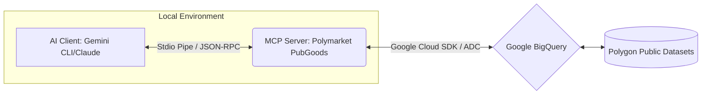
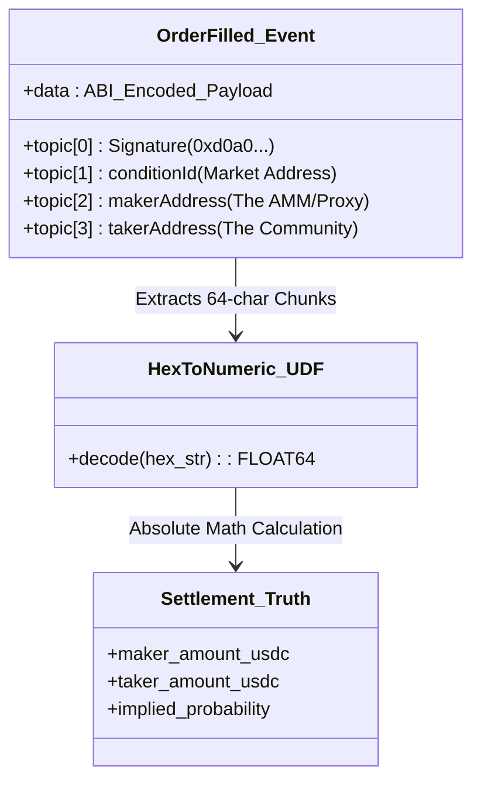
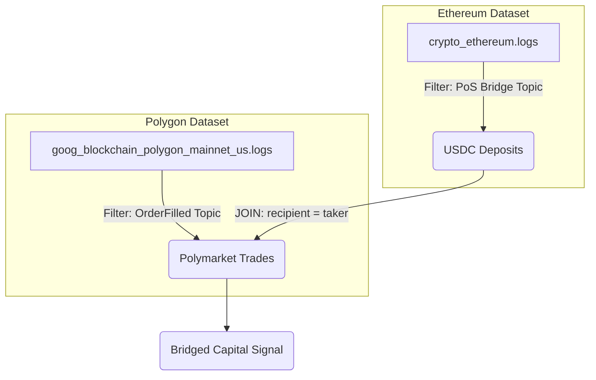

# Architecture & Schema: BigQuery Polymarket PubGoods

> Modern tooling for community public goods, powered by Google BigQuery.

This document outlines the technical design, data schema, and cross-chain routing architecture of the MCP server.

## 1. The Local Intelligence Bridge
The MCP server runs entirely on your local machine, creating a secure, zero-friction bridge between your preferred AI client and Google's BigQuery infrastructure.

## 2. The Zero-Simulation Settlement Schema
Polymarket's matching engine operates off-chain, but every matched trade is settled on the Polygon blockchain via the `OrderFilled` event. This MCP calculates the true market price (Implied Probability) directly from the raw EVM hexadecimal payload, requiring no external APIs.

## 3. The Cross-Chain Capital Mesh
To understand where liquidity originates, the advanced tools (e.g., `flows_bridge_stablecoin`) perform massive cross-dataset joins. This maps the journey of a USDC dollar from an Ethereum deposit directly to a Polymarket trade on Polygon.

## 4. On-Chain vs. Off-Chain Anatomy
When analyzing a Polymarket event page, it is critical for AI agents to understand which elements are verifiable on-chain truths versus off-chain interfaces.

*   **The Price (e.g., 65¢)**: 🔴 **ON-CHAIN**. This is the **Implied Probability** calculated in `trades_filled` by dividing Maker and Taker execution amounts.
*   **The "Buy" Execution**: 🔴 **ON-CHAIN**. Clicking buy and signing the transaction emits the **`OrderFilled`** event our server audits.
*   **The Market ID**: 🔴 **ON-CHAIN**. The `conditionId` in the URL (e.g., `0x0647...`) is the **`topics[1]`** hash we use for all dataset filters.
*   **The Order Book Depth**: ⚪ **OFF-CHAIN**. The list of resting limit orders is maintained in Polymarket's private API. We only see them once they "settle" on-chain.
*   **The Question Text**: ⚪ **OFF-CHAIN**. The human-readable string (e.g., "Will BTC hit $100k?") is generally stored in IPFS or a private database, mapped to the on-chain hash.
